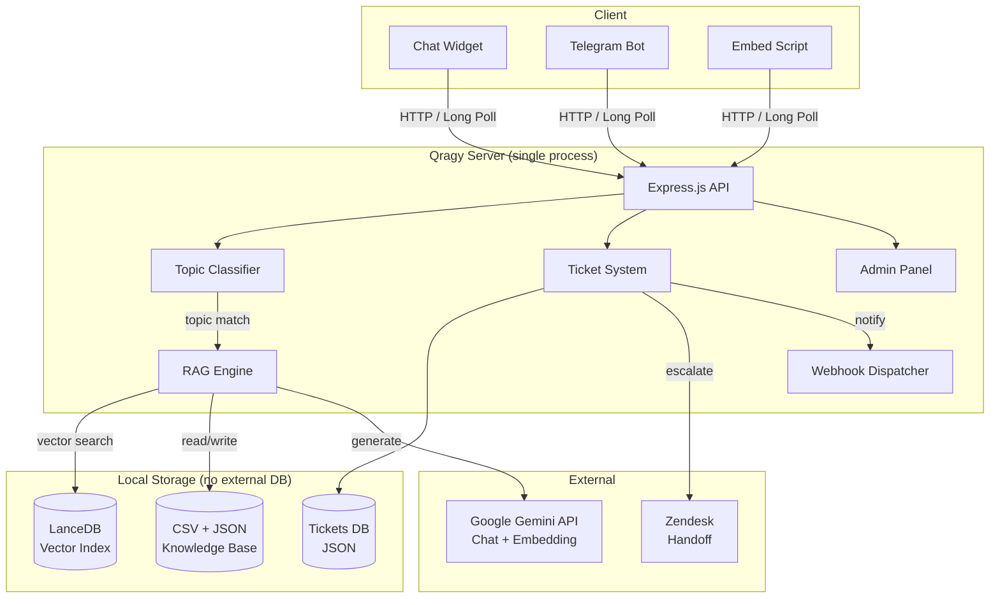

<p align="center">
  
</p>

<h1 align="center">Qragy</h1>

<p align="center">
  <strong>Self-hosted RAG chatbot that runs on a Raspberry Pi. $0/month.</strong>
</p>

<p align="center">
  <a href="https://github.com/mahsumaktas/qragy/stargazers"></a>
  <a href="https://github.com/mahsumaktas/qragy/releases"></a>
  <a href="LICENSE"></a>
  
  
  <a href="CONTRIBUTING.md"></a>
</p>

<p align="center">
  <a href="#quick-start">Quick Start</a> · 
  <a href="#features">Features</a> · 
  <a href="#architecture">Architecture</a> · 
  <a href="#admin-panel">Admin Panel</a> · 
  <a href="#deploy">Deploy</a> · 
  <a href="#api">API</a> · 
  <a href="#configuration">Configuration</a>
</p>

<p align="center">
  <a href="https://render.com/deploy?repo=https://github.com/mahsumaktas/qragy"></a>
</p>

---

## Why Qragy?

**Dify needs Docker, Redis, and Postgres.** Botpress is cloud-only. Intercom costs $74/seat/month.

**Qragy needs one command: `npm start`.**

It uses [LanceDB](https://lancedb.com) (embedded vector DB) and Google Gemini (free tier), so you get a production-ready AI support chatbot with zero infrastructure cost — even on a **$35 Raspberry Pi**.

> One process. One CSV file. Zero cloud bills.

---

## Features

### 🧠 RAG-Powered AI
- **Vector search** over your knowledge base using LanceDB (embedded, serverless)
- **Topic routing** — keywords + AI classify issues into structured flows
- **Deterministic collection** — bot gathers required info before escalating
- **Model fallback** — automatic retry with a secondary Gemini model

### 🎛️ Admin Panel (`/admin`)
Manage everything from the browser — no code, no CLI:

| Tab | What You Can Do |
|-----|----------------|
| **Tickets** | Full chat histories, handoff status, assignment, priority, internal notes |
| **Knowledge Base** | CRUD for Q&A entries, file upload (PDF/DOCX/TXT), one-click re-embed |
| **Bot Config** | Edit persona, topics, escalation rules, memory templates, env vars |
| **Analytics** | Daily metrics, top topics, resolution rates, SVG charts |
| **System** | Health monitoring, uptime, memory usage, hot-reload |

### 📦 Zero Infrastructure
- **LanceDB** — embedded vector DB, no separate server (unlike Pinecone/Weaviate/Qdrant)
- **File-based storage** — CSV + JSON + LanceDB files. No PostgreSQL, no Redis
- **Single process** — one `node server.js`, that's it
- **No build step** — vanilla JS frontend, zero bundling

### 🔌 Integrations
- **Zendesk** — automatic widget + Sunshine Conversations handoff
- **Telegram** — bot channel via long polling
- **Webhooks** — HMAC-SHA256 signed events to Slack, n8n, Zapier
- **Embeddable widget** — one `<script>` tag on any website

### 🆓 Free Embedding Models

| Provider | Model | Dimensions | Cost |
|----------|-------|-----------|------|
| **Google Gemini** *(default)* | `gemini-embedding-001` | 3072 | Free tier |
| **OpenAI** | `text-embedding-3-small` | 1536 | $0.02/1M tokens |

### 🚀 v2 Highlights
- Rate limiting (per-IP, configurable)
- File upload with auto-chunking (PDF, DOCX, TXT)
- Team features: ticket assignment, priority levels, internal notes
- Prompt versioning with auto-snapshot and rollback
- Auto-deploy webhook support

---

## Architecture



**Message flow:**

1. User sends a message → **Topic detection** (keywords + AI classification)  
2. **RAG search** finds relevant Q&A from the knowledge base  
3. **Gemini** generates a contextual reply using topic instructions + RAG results  
4. Bot collects required fields → **Escalation** to Zendesk when needed  

---

## Quick Start

```bash
# Clone & install
git clone https://github.com/mahsumaktas/qragy.git
cd qragy && npm install

# Configure (only GOOGLE_API_KEY is required)
cp .env.example .env
# Get a free key at https://aistudio.google.com

# Ingest your knowledge base
node scripts/ingest.js

# Run
npm start
```

Open [localhost:3000](http://localhost:3000) for the chatbot, [localhost:3000/admin](http://localhost:3000/admin) for the admin panel.

---

## Deploy

### Raspberry Pi

```bash
git clone https://github.com/mahsumaktas/qragy.git
cd qragy && npm install
cp .env.example .env    # add your GOOGLE_API_KEY
node scripts/ingest.js
npm install -g pm2
pm2 start server.js --name qragy
pm2 save && pm2 startup
```

### Render (One-Click)

[](https://render.com/deploy?repo=https://github.com/mahsumaktas/qragy)

### Any VPS / Docker

Works on any machine with Node.js 18+. No Docker required, but runs fine in a container too.

---

## Configuration

| Variable | Description | Default |
|----------|-------------|---------|
| `GOOGLE_API_KEY` | Gemini API key **(required)** | — |
| `GOOGLE_MODEL` | Chat model | `gemini-3-pro-preview` |
| `GOOGLE_FALLBACK_MODEL` | Fallback model on error | — |
| `BOT_NAME` | Bot display name | `QRAGY Bot` |
| `COMPANY_NAME` | Your company name | — |
| `ADMIN_TOKEN` | Admin panel password | — |
| `ZENDESK_ENABLED` | Enable Zendesk handoff | `false` |
| `TELEGRAM_ENABLED` | Enable Telegram bot | `false` |
| `TELEGRAM_BOT_TOKEN` | Telegram Bot API token | — |
| `RATE_LIMIT_ENABLED` | Per-IP rate limiting | `true` |
| `RATE_LIMIT_MAX` | Max requests per window | `20` |
| `WEBHOOK_ENABLED` | Enable webhook notifications | `false` |
| `WEBHOOK_URL` | Webhook endpoint URL | — |
| `WEBHOOK_SECRET` | HMAC-SHA256 signing secret | — |
| `SUPPORT_HOURS_ENABLED` | Enforce business hours | `false` |
| `DETERMINISTIC_COLLECTION_MODE` | Structured info gathering | `true` |

Full list in [`.env.example`](.env.example).

---

## Embedding Widget

Add Qragy to any website:

```html
<script>
  window.__QRAGY_API = "https://your-qragy-server.com";
</script>
<script src="https://your-qragy-server.com/embed.js"></script>
```

---

## Project Structure

```
qragy/
├── server.js                    # API, AI, RAG, tickets — single file
├── knowledge_base.example.csv   # Example Q&A data
├── agent/                       # Bot personality & rules
│   ├── soul.md                  # Identity
│   ├── persona.md               # Tone & style
│   ├── topics/                  # Structured support flows
│   │   ├── _index.json          # Topic registry
│   │   └── *.md                 # Topic instructions
│   └── ...                      # Escalation, filtering, etc.
├── memory/                      # Conversation & ticket templates
├── public/                      # Frontend (vanilla JS)
│   ├── index.html               # Chat UI
│   ├── admin.html               # Admin panel
│   └── embed.js                 # Embeddable widget
├── scripts/ingest.js            # CSV → LanceDB embedder
└── data/                        # Runtime data (auto-created)
```

---

## Qragy vs Alternatives

| | **Qragy** | Dify | Botpress | Intercom |
|---|:---:|:---:|:---:|:---:|
| Fully self-hosted | ✅ | ⚠️ Partial | ❌ | ❌ |
| Runs on Raspberry Pi | ✅ | ❌ | ❌ | ❌ |
| Vector DB | Embedded | External | External | Managed |
| Monthly cost | **$0** | Free tier limited | Free tier limited | $74+/seat |
| Admin panel | Built-in | ✅ | ✅ | ✅ |
| Setup time | **2 min** | 30+ min | 15+ min | N/A |
| Open source | MIT | Apache 2.0 | AGPL | ❌ |
| Dependencies | 6 npm packages | Docker + Redis + Postgres | Cloud | Cloud |

---

## API

All admin endpoints require `x-admin-token` header when `ADMIN_TOKEN` is set.

<details>
<summary><strong>View all endpoints</strong></summary>

### Chat
- `POST /api/chat` — Send message, get AI response

### Tickets
- `GET /api/admin/summary` — Dashboard stats
- `GET /api/admin/tickets` — List tickets
- `GET /api/admin/tickets/:id` — Ticket detail
- `PUT /api/admin/tickets/:id/assign` — Assign to team member
- `PUT /api/admin/tickets/:id/priority` — Set priority
- `POST /api/admin/tickets/:id/notes` — Add internal note

### Knowledge Base
- `GET /api/admin/knowledge` — List entries
- `POST /api/admin/knowledge` — Add entry
- `PUT /api/admin/knowledge/:id` — Update entry
- `DELETE /api/admin/knowledge/:id` — Delete entry
- `POST /api/admin/knowledge/reingest` — Rebuild vector index
- `POST /api/admin/knowledge/upload` — Upload PDF/DOCX/TXT

### Bot Config
- `GET/PUT /api/admin/agent/files/:name` — Read/write agent files
- `GET/POST/PUT/DELETE /api/admin/agent/topics/:id` — Topic CRUD
- `GET/PUT /api/admin/agent/memory/:name` — Memory templates
- `GET/PUT /api/admin/env` — Environment variables

### Analytics & System
- `GET /api/admin/analytics` — Metrics and charts
- `GET /api/admin/system` — Health info
- `POST /api/admin/agent/reload` — Hot-reload config

### Webhooks
- `GET /api/admin/webhooks/config` — Get config
- `PUT /api/admin/webhooks/config` — Update config
- `POST /api/admin/webhooks/test` — Send test webhook

### Prompt Versions
- `GET /api/admin/agent/versions` — List versions
- `POST /api/admin/agent/versions/rollback` — Rollback

</details>

---

## Tech Stack

| Layer | Technology |
|-------|-----------|
| Runtime | Node.js 18+ |
| Framework | Express.js |
| AI | Google Gemini (chat + embedding) |
| Vector DB | LanceDB (embedded, serverless) |
| Embeddings | `gemini-embedding-001` (3072d) |
| Frontend | Vanilla JS — zero build step |
| Storage | CSV + JSON files |

---

## Contributing

We welcome contributions! See [CONTRIBUTING.md](CONTRIBUTING.md) for guidelines.

## License

[MIT](LICENSE) — use it however you want.

---

<p align="center">
  <sub>Built with ❤️ by <a href="https://github.com/mahsumaktas">Mahsum Aktas</a></sub>
</p>
