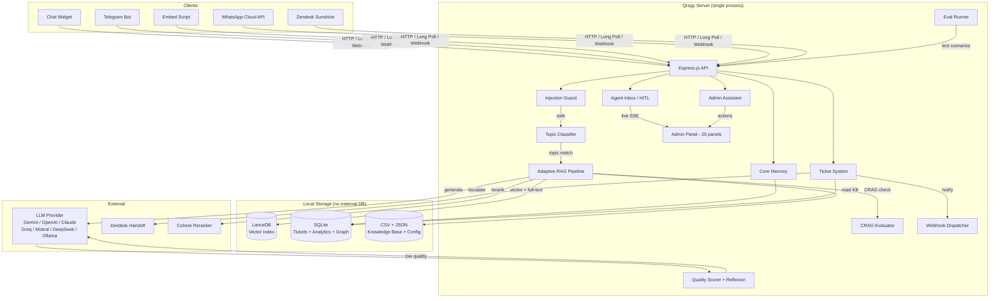

<p align="center">
  
</p>

<h1 align="center">Qragy</h1>

<p align="center">
  <strong>Self-hosted AI support chatbot with RAG, human-in-the-loop, and full admin panel.<br/>Runs on a Raspberry Pi. $0/month.</strong>
</p>

<p align="center">
  <a href="https://github.com/mahsumaktas/qragy/stargazers"></a>
  <a href="https://github.com/mahsumaktas/qragy/releases"></a>
  <a href="LICENSE"></a>
  
  
  <a href="CONTRIBUTING.md"></a>
</p>

<p align="center">
  <a href="#quick-start">Quick Start</a> &middot;
  <a href="#features">Features</a> &middot;
  <a href="#architecture">Architecture</a> &middot;
  <a href="#admin-panel">Admin Panel</a> &middot;
  <a href="#eval-system">Eval System</a> &middot;
  <a href="#integrations">Integrations</a> &middot;
  <a href="#deploy">Deploy</a> &middot;
  <a href="#api">API</a> &middot;
  <a href="#configuration">Configuration</a>
</p>

<p align="center">
  <a href="https://render.com/deploy?repo=https://github.com/mahsumaktas/qragy"></a>
</p>

---

## Why Qragy?

**Dify needs Docker, Redis, and Postgres.** Botpress is cloud-only. Intercom costs $74/seat/month.

**Qragy needs one command: `npm start`.** It ships with 7 LLM providers, hybrid RAG, a full admin panel, human-in-the-loop agent inbox, eval testing framework, and multi-channel integrations — all in a single Node.js process with zero external infrastructure.

It uses [LanceDB](https://lancedb.com) (embedded vector DB) and [SQLite](https://www.sqlite.org/) for storage, so you get a production-ready AI support chatbot with zero infrastructure cost — even on a **$35 Raspberry Pi**.

> One process. One CSV file. 7 npm dependencies. Zero cloud bills.

| Feature | Qragy | Dify | Botpress | Intercom |
|---------|-------|------|----------|----------|
| Fully self-hosted | Yes | Partial | No | No |
| Runs on Raspberry Pi | Yes | No | No | No |
| Min RAM | **150 MB** | 4 GB+ | 2 GB+ | N/A |
| Setup time | **30 sec** | 30+ min | 15+ min | N/A |
| LLM providers | **7** | 10+ | 3 | 1 |
| Hybrid RAG + CRAG | Yes | Partial | No | No |
| Human-in-the-loop | Yes | No | Yes | Yes |
| Eval framework | Built-in | No | No | No |
| Vector DB | Embedded | External | External | Managed |
| Admin panel | Built-in (25 panels) | Yes | Yes | Yes |
| Monthly cost | **$0** | Free tier limited | Free tier limited | $74+/seat |
| Open source | AGPL-3.0 | Apache 2.0 | AGPL | No |
| Dependencies | 7 npm | Docker + Redis + Postgres | Cloud | Cloud |

---

## Features

### AI & RAG Engine

- **7 LLM providers** — Gemini, OpenAI, Anthropic (Claude), Groq, Mistral, DeepSeek, Ollama — all via raw `fetch()`, zero extra dependencies
- **Model fallback chain** — automatic retry on 429/500/503/504 with configurable fallback models and circuit breaker health tracking
- **Hybrid search** — vector search (LanceDB) + full-text search with Reciprocal Rank Fusion (RRF) scoring
- **3-tier reranker** — Cohere API > LLM-based > text similarity scoring (automatic fallback)
- **CRAG (Corrective RAG)** — evaluates search result relevance (RELEVANT/PARTIAL/IRRELEVANT), rewrites queries up to 2 times when results are insufficient
- **Adaptive pipeline** — three modes: FAST (direct LLM, no retrieval), STANDARD (hybrid search + rerank), DEEP (search + rerank + CRAG + sub-queries)
- **Quality scoring** — automatic response quality evaluation with confidence scores
- **Reflexion** — self-reflection on low-quality answers, triggers re-generation with improved context
- **Smart chunking** — markdown, recursive, sentence, and contextual document splitting strategies
- **Topic routing** — keyword matching + AI classification routes conversations into structured support flows
- **Deterministic collection** — bot gathers required fields step-by-step before escalating to a human
- **Conversation state machine** — `welcome_or_greet` → `topic_detection` → `topic_guided_support` → `escalation_handoff` (+ farewell, fallback states)

### Memory System

- **Core memory (MemGPT-style)** — automatically extracts user profile facts (name, company, preferences) from conversations, injects into system prompt with 500-token budget
- **Recall memory** — full conversation history with full-text search, enables cross-session context
- **Memory templates** — configurable memory extraction patterns per use case

### Knowledge Base

- **CSV-based Q&A** — simple question/answer format, easy to edit and version
- **File upload** — PDF, DOCX, XLSX, TXT parsing with automatic chunking and embedding
- **One-click re-embed** — rebuild the entire vector index from the admin panel
- **Knowledge graph** — extracts entities (product, issue_type, resolution, customer_segment) and relationships from resolved tickets, stored in SQLite
- **Content gap detection** — identifies questions the bot cannot answer, suggests new KB entries
- **Auto-FAQ generation** — generates FAQ entries from recurring ticket patterns

### Security

- **Prompt injection guard** — two-layer detection: 12 regex patterns (ignore instructions, jailbreak, DAN, roleplay) + LLM-based relevance guard for off-topic detection
- **Output validation** — checks for AI confession phrases, prompt leaks, and internal data exposure
- **PII masking** — automatic detection and masking of personal identifiable information in logs
- **Credential masking** — prevents API keys and tokens from appearing in error messages or logs
- **Rate limiting** — per-IP request throttling with configurable window and max requests
- **Security headers** — Helmet.js, CORS configuration, CSP headers
- **HMAC-SHA256 webhooks** — all outgoing webhooks are signed for verification

### Infrastructure

- **Single process** — one `node server.js`, no orchestration needed
- **Embedded databases** — LanceDB (vectors) + SQLite (tickets, analytics, graph) — no external DB servers
- **File-based config** — CSV knowledge base, JSON config files, markdown agent prompts
- **No build step** — vanilla JS frontend, zero bundling or compilation
- **PWA support** — service worker with offline caching (cache-first for static, network-first for API), web push notifications
- **Auto-deploy** — GitHub webhook receiver with HMAC-SHA256 verification, triggers `deploy.sh` on push to main
- **Hot-reload** — update bot config, topics, persona without restarting the server

### Free Embedding Models

| Provider | Model | Dimensions | Cost |
|----------|-------|-----------|------|
| **Google Gemini** *(default)* | `gemini-embedding-001` | 3072 | Free tier |
| **OpenAI** | `text-embedding-3-small` | 1536 | $0.02/1M tokens |
| **Ollama** | `nomic-embed-text` | 768 | Free (local) |

---

## Admin Panel

Full browser-based management — no code, no CLI needed. 25 panels organized by function:

### Tickets & Conversations

| Panel | Description |
|-------|-------------|
| **Live Chats** | Active conversations with real-time updates, handoff status indicators |
| **Closed Chats** | Full chat histories with search, assignment, priority, internal notes |
| **Search** | Full-text search across all conversations and tickets |
| **Agent Inbox (HITL)** | Human-in-the-loop: claim conversations, live SSE updates, type replies in real-time |

### Knowledge & Content

| Panel | Description |
|-------|-------------|
| **Knowledge Base** | CRUD for Q&A entries, file upload (PDF/DOCX/XLSX/TXT), one-click vector re-embed |
| **Auto-FAQ** | Auto-generated FAQ entries from ticket patterns, one-click add to KB |
| **Content Gaps** | Unanswered questions the bot couldn't handle, prioritized by frequency |

### Bot Configuration

| Panel | Description |
|-------|-------------|
| **Agent Files** | Edit persona, soul, domain rules, hard-bans, response policy, escalation matrix — all from the browser |
| **Topics** | Create/edit/delete structured support flows with step-by-step guides and escalation rules |
| **Memory Templates** | Configure what user facts the bot should remember across conversations |
| **Environment** | View and edit `.env` variables at runtime |
| **Chat Flow** | Configure conversation behavior: greeting, fallback, collection mode, state transitions |
| **Site Config** | Widget appearance, company branding, business hours |
| **Prompt Versions** | Version history of all prompt changes with one-click rollback |

### Integrations

| Panel | Description |
|-------|-------------|
| **Webhooks** | Configure webhook endpoints, select event types, test delivery, view delivery logs |
| **Zendesk Sunshine** | Two-way Zendesk Sunshine Conversations integration config |
| **WhatsApp** | Direct WhatsApp Cloud API integration setup |

### Analytics & Insights

| Panel | Description |
|-------|-------------|
| **Dashboard** | Daily metrics, top topics, resolution rates, SVG charts |
| **Analytics** | Detailed conversation analytics, response time tracking |
| **Feedback Report** | User satisfaction (CSAT 1-5), thumbs up/down tracking |
| **SLA Monitoring** | Response time SLA compliance tracking |

### System & Testing

| Panel | Description |
|-------|-------------|
| **Bot Test** | Multi-chat grid — open parallel sessions to test the bot side by side |
| **Admin Assistant** | AI-powered assistant that can read/update config, manage KB, execute admin actions |
| **Eval Management** | Run eval scenarios, view results, manage test suites (see [Eval System](#eval-system)) |
| **System Health** | Uptime, memory usage, LLM health, audit log, database stats, backup/export |
| **Setup Wizard** | First-run onboarding: API key, bot name, persona, knowledge base setup — no `.env` editing needed |

---

## Eval System

Built-in evaluation framework for testing chatbot quality. Run scenarios from the admin panel or CLI.

### How It Works

1. **Scenarios** — multi-turn conversation scripts with expected outcomes defined in `tests/eval/scenarios.json`
2. **Judge** — rule-based assertion engine (`judge.js`) that checks bot responses against 10 assertion types
3. **Runner** — sends messages to the live chat API, collects responses, runs assertions
4. **Consensus** — runs each scenario N times (default 3), distinguishes real failures from flaky results

### Assertion Types

| Assertion | Description |
|-----------|-------------|
| `shouldContainAny` | Response must contain at least one of the specified strings |
| `shouldNotContain` | Response must not contain any of the specified strings |
| `shouldNotContainAny` | Response must not contain any of the specified strings |
| `stateShouldBe` | Conversation state must match expected value |
| `topicShouldBe` | Detected topic must match expected value |
| `handoffReady` | Escalation handoff must be triggered (or not) |
| `earlyEscalation` | Check for premature escalation |
| `branchCodeShouldBe` | Extracted branch code must match |
| `isFarewell` | Response should (not) be a farewell message |
| `shouldNotRepeatPrevious` | Response must differ from previous reply (Jaccard similarity < 0.6) |

### Running Evals

**From admin panel:**
- Open **Eval Management** panel
- Click **Run** on a single scenario or **Run All** for the full suite
- SSE streaming shows real-time progress with pass/fail results
- Results are saved to history with pass rate and duration

**From CLI:**
```bash
npx vitest run tests/eval/chatbot-eval.test.js
```

### Consensus Mode

When running all scenarios, each is executed 3 times (configurable). If at least 1 run passes, it's marked as **flaky** (acceptable). If all 3 fail, it's a **real failure**. This eliminates false negatives from LLM non-determinism.

---

## Integrations

### Embeddable Widget

Add Qragy to any website with one script tag:

```html
<script>
  window.__QRAGY_API = "https://your-qragy-server.com";
</script>
<script src="https://your-qragy-server.com/embed.js"></script>
```

Cross-origin communication via `postMessage`. Customizable appearance from the admin panel.

### Zendesk Sunshine Conversations

Two-way integration: bot handles initial conversation, escalates to Zendesk agent when needed. Zendesk agent replies flow back through the bot.

### WhatsApp (Cloud API)

Direct WhatsApp Business Cloud API integration. Configure from the admin panel — no middleware required.

### Telegram

Long-polling Telegram bot. Enable with `TELEGRAM_ENABLED=true` and your bot token.

### Webhooks

Send signed events to any endpoint (Slack, n8n, Zapier, custom):

- **HMAC-SHA256** signed with `X-Qragy-Signature` header
- **Event filtering** — subscribe to specific events or `*` wildcard
- **Retry** — 3 attempts with exponential backoff (1s, 2s, 4s)
- **Delivery log** — last 200 deliveries with status and response
- **Max 10 webhooks** per event

### Auto-Deploy

GitHub webhook receiver at `/deploy`. Verifies `X-Hub-Signature-256`, triggers `deploy.sh` on push to `main`.

---

## Architecture



### Message Flow

1. **Input** — user sends a message via widget, Telegram, WhatsApp, or Zendesk
2. **Injection guard** — regex patterns + LLM relevance check filter malicious input
3. **Topic detection** — keyword matching + AI classification routes to structured flow
4. **Adaptive RAG** — FAST/STANDARD/DEEP pipeline based on query complexity
5. **CRAG evaluation** — checks search result relevance, rewrites query if needed
6. **LLM generation** — contextual reply with persona, topic guide, and memory
7. **Quality scoring** — evaluates response quality, triggers reflexion if low
8. **Collection** — bot gathers required fields step-by-step (deterministic mode)
9. **Escalation** — hands off to Zendesk, agent inbox, or webhook when criteria are met

### Design Patterns

- **Factory + DI** — services use `createXxxService(deps)`, all dependencies injected
- **Route mounting** — routes use `mount(app, deps)` pattern
- **CommonJS** — all modules use `require()` / `module.exports`
- **Getter closures** — mutable runtime config accessed via `() => VALUE` getters
- **Fire-and-forget** — memory updates, analytics, graph building run async without blocking response

---

## Quick Start

### Docker (Fastest)

```bash
docker run -d -p 3001:3000 \
  -e GOOGLE_API_KEY=your_key \
  -v qragy-data:/app/data \
  ghcr.io/mahsumaktas/qragy
```

Open `http://localhost:3001` — done.

### From Source

```bash
# Clone & install
git clone https://github.com/mahsumaktas/qragy.git
cd qragy && npm install

# Configure (only GOOGLE_API_KEY is required)
cp .env.example .env
# Get a free key at https://aistudio.google.com

# Ingest your knowledge base
node scripts/ingest.js

# Run
npm start
```

Open [localhost:3000](http://localhost:3000) for the chatbot, [localhost:3000/admin](http://localhost:3000/admin) for the admin panel.

> **First run?** The setup wizard at `/admin` guides you through API key, bot name, persona, and knowledge base — no `.env` editing needed.

---

## Multi-Model Configuration

Qragy supports **7 LLM providers** out of the box via raw `fetch()` — zero extra dependencies.

### Gemini (Default, Free Tier)

```env
GOOGLE_API_KEY=your_key_here
```

### OpenAI

```env
LLM_PROVIDER=openai
LLM_API_KEY=sk-...
LLM_MODEL=gpt-4o-mini
EMBEDDING_PROVIDER=openai
EMBEDDING_MODEL=text-embedding-3-small
```

### Anthropic (Claude)

```env
LLM_PROVIDER=anthropic
LLM_API_KEY=sk-ant-...
LLM_MODEL=claude-sonnet-4-6
```

### Groq (Fast Inference)

```env
LLM_PROVIDER=groq
LLM_API_KEY=gsk_...
LLM_MODEL=llama-3.3-70b-versatile
```

### Mistral

```env
LLM_PROVIDER=mistral
LLM_API_KEY=...
LLM_MODEL=mistral-large-latest
```

### DeepSeek

```env
LLM_PROVIDER=deepseek
LLM_API_KEY=...
LLM_MODEL=deepseek-chat
LLM_BASE_URL=https://api.deepseek.com/v1
```

### Ollama (Fully Local, No API Key)

```env
LLM_PROVIDER=ollama
LLM_MODEL=llama3.2
LLM_BASE_URL=http://localhost:11434/v1
EMBEDDING_PROVIDER=ollama
EMBEDDING_MODEL=nomic-embed-text
EMBEDDING_BASE_URL=http://localhost:11434
```

All `GOOGLE_*` environment variables continue to work for backward compatibility. See [`.env.example`](.env.example) for all options.

---

## Deploy

### Render (One-Click)

[](https://render.com/deploy?repo=https://github.com/mahsumaktas/qragy)

### Docker Compose

```bash
git clone https://github.com/mahsumaktas/qragy.git
cd qragy
cp .env.example .env   # add your API key
docker compose up -d
```

### Raspberry Pi

```bash
git clone https://github.com/mahsumaktas/qragy.git
cd qragy && npm install
cp .env.example .env    # add your GOOGLE_API_KEY
node scripts/ingest.js
npm install -g pm2
pm2 start server.js --name qragy
pm2 save && pm2 startup
```

### Any VPS / Docker

Works on any machine with Node.js 18+. No Docker required, but runs fine in a container too.

---

## Configuration

| Variable | Description | Default |
|----------|-------------|---------|
| `GOOGLE_API_KEY` | Gemini API key **(required for Gemini)** | — |
| `LLM_PROVIDER` | `gemini`, `openai`, `anthropic`, `groq`, `mistral`, `deepseek`, `ollama` | `gemini` |
| `LLM_API_KEY` | API key (falls back to `GOOGLE_API_KEY`) | — |
| `LLM_MODEL` | Chat model | — |
| `LLM_BASE_URL` | Custom base URL (Ollama, DeepSeek, etc.) | — |
| `GOOGLE_FALLBACK_MODEL` | Fallback model on error | — |
| `EMBEDDING_PROVIDER` | Embedding provider | `gemini` |
| `EMBEDDING_MODEL` | Embedding model | `gemini-embedding-001` |
| `BOT_NAME` | Bot display name | `QRAGY Bot` |
| `COMPANY_NAME` | Your company name | — |
| `ADMIN_TOKEN` | Admin panel password | — |
| `PORT` | Server port | `3000` |
| `RATE_LIMIT_ENABLED` | Per-IP rate limiting | `true` |
| `RATE_LIMIT_MAX` | Max requests per window | `20` |
| `DETERMINISTIC_COLLECTION_MODE` | Structured info gathering | `true` |
| `SUPPORT_HOURS_ENABLED` | Enforce business hours | `false` |
| `ZENDESK_ENABLED` | Enable Zendesk handoff | `false` |
| `TELEGRAM_ENABLED` | Enable Telegram bot | `false` |
| `TELEGRAM_BOT_TOKEN` | Telegram Bot API token | — |
| `WHATSAPP_ENABLED` | Enable WhatsApp integration | `false` |
| `WEBHOOK_ENABLED` | Enable webhook notifications | `false` |
| `WEBHOOK_URL` | Webhook endpoint URL | — |
| `WEBHOOK_SECRET` | HMAC-SHA256 signing secret | — |

Full list in [`.env.example`](.env.example).

---

## Embedding Widget

Add Qragy to any website:

```html
<script>
  window.__QRAGY_API = "https://your-qragy-server.com";
</script>
<script src="https://your-qragy-server.com/embed.js"></script>
```

---

## Project Structure

```
qragy/
├── server.js                          # Express app, middleware, route mounting
├── src/
│   ├── config/index.js                # Centralized env config loader + validation
│   ├── routes/
│   │   ├── admin/                     # Admin panel API (25 panels)
│   │   │   ├── index.js               # Route aggregator
│   │   │   ├── agent.js               # Agent config CRUD
│   │   │   ├── analytics.js           # Analytics + feedback
│   │   │   ├── config.js              # Runtime config management
│   │   │   ├── eval.js                # Eval CRUD + SSE test runner
│   │   │   ├── insights.js            # SLA, auto-FAQ, content gaps
│   │   │   ├── knowledge.js           # Knowledge base CRUD + upload
│   │   │   ├── system.js              # Health, audit log, backup
│   │   │   ├── tickets.js             # Ticket CRUD + bulk ops + prompt versions
│   │   │   └── webhooks.js            # Webhook config + test
│   │   ├── chat.js                    # POST /api/chat — main endpoint
│   │   ├── conversation.js            # Handoff, CSAT, upload, session
│   │   ├── deploy.js                  # GitHub webhook auto-deploy
│   │   ├── health.js                  # GET /api/health
│   │   └── widget.js                  # Widget configuration
│   ├── services/
│   │   ├── pipeline/chatPipeline.js   # Adaptive RAG pipeline (FAST/STANDARD/DEEP)
│   │   ├── rag/
│   │   │   ├── queryAnalyzer.js       # Query intent analysis
│   │   │   ├── reranker.js            # 3-tier reranker (Cohere > LLM > text)
│   │   │   ├── cragEvaluator.js       # Corrective RAG evaluation
│   │   │   └── contextualChunker.js   # Context-aware document chunking
│   │   ├── intelligence/
│   │   │   ├── qualityScorer.js       # Response quality scoring
│   │   │   ├── reflexion.js           # Self-reflection on low-quality answers
│   │   │   └── graphBuilder.js        # Knowledge graph builder
│   │   ├── memory/coreMemory.js       # MemGPT-style persistent user memory
│   │   ├── webChatPipeline.js         # Web chat orchestration
│   │   ├── chatProcessor.js           # Chat message processing
│   │   ├── topic.js                   # Topic classification (keyword + AI)
│   │   ├── escalation.js              # Escalation rule evaluation
│   │   ├── conversationManager.js     # Conversation CRUD + state tracking
│   │   ├── ticketStore.js             # Ticket CRUD + duplicate detection
│   │   ├── analytics.js               # Event buffer + daily aggregation
│   │   ├── knowledge.js               # KB search + content gaps
│   │   ├── webhooks.js                # HMAC-signed delivery with retry
│   │   ├── llmHealth.js               # LLM circuit breaker
│   │   ├── supportHours.js            # Business hours calculation
│   │   └── responseValidator.js       # Bot response safety validation
│   ├── prompt/builder.js              # System prompt assembly + token budgeting
│   ├── middleware/
│   │   ├── auth.js                    # Admin token authentication
│   │   ├── rateLimiter.js             # Per-IP rate limiting
│   │   ├── security.js                # CORS, Helmet, security headers
│   │   └── injectionGuard.js          # Prompt injection detection (regex + LLM)
│   └── utils/
│       ├── sanitizer.js               # PII masking, text normalization
│       ├── logger.js                  # Structured logger [ISO] [LEVEL] [context]
│       ├── validators.js              # Input validators (email, phone, etc.)
│       └── ...                        # Session, error helpers, CSV tools
├── lib/
│   ├── providers.js                   # Multi-model LLM + embedding abstraction
│   ├── chunker.js                     # Document chunking engine
│   └── db.js                          # SQLite database layer
├── agent/                             # Bot personality & configuration
│   ├── soul.md, persona.md            # Identity & tone
│   ├── domain.md                      # Domain knowledge rules
│   ├── topics/                        # Structured support flow definitions
│   ├── escalation-matrix.md           # Escalation rules
│   ├── hard-bans.md                   # Banned topics/responses
│   ├── output-filter.md               # Output filtering rules
│   └── templates/                     # Industry templates (e-commerce, restaurant, tech support)
├── tests/
│   ├── unit/                          # 108 test files, 560+ tests
│   ├── eval/
│   │   ├── scenarios.json             # 85 eval scenarios
│   │   ├── judge.js                   # Rule-based assertion engine
│   │   └── chatbot-eval.test.js       # Vitest eval runner
│   └── integration/                   # Integration tests
├── public/                            # Frontend (vanilla JS, no build step)
│   ├── admin.html, admin.js, admin.css # Admin panel
│   ├── embed.js                       # Embeddable widget script
│   └── sw.js                          # Service worker (PWA)
├── scripts/ingest.js                  # CSV → LanceDB embedding ingestion
├── Dockerfile                         # Docker image
├── docker-compose.yml                 # Container setup
├── .github/workflows/ci.yml           # CI: lint + test + coverage
└── data/                              # Runtime data (auto-created, gitignored)
```

---

## Development

### Prerequisites

- Node.js 18+ (20+ recommended)
- npm

### Setup

```bash
git clone https://github.com/mahsumaktas/qragy.git
cd qragy && npm install
cp .env.example .env  # add your API key
```

### Running Tests

```bash
npm test                  # Run all unit + integration tests (560+)
npm run test:coverage     # Run with V8 coverage report
```

### Running Evals

```bash
# Start the server first, then:
npx vitest run tests/eval/chatbot-eval.test.js
```

Or use the admin panel **Eval Management** panel for a visual interface with SSE streaming.

### Linting

```bash
npx eslint .              # Check for lint errors
npx eslint . --fix        # Auto-fix fixable issues
```

### Code Quality

- **ESLint** with flat config — enforces `eqeqeq`, `no-var`, `prefer-const`
- **Vitest** for unit + integration testing with V8 coverage
- **CI pipeline** — lint + test on every push/PR to main
- **Eval framework** — 85 scenarios with consensus runs for regression testing

---

## API

> Interactive API documentation available at `/api-docs` when the server is running.

All admin endpoints require `x-admin-token` header when `ADMIN_TOKEN` is set.

<details>
<summary><strong>View all endpoints</strong></summary>

### Chat
- `POST /api/chat` — Send message, get AI response

### Tickets
- `GET /api/admin/summary` — Dashboard stats
- `GET /api/admin/tickets` — List tickets (with pagination, filters)
- `GET /api/admin/tickets/:id` — Ticket detail with full conversation
- `PUT /api/admin/tickets/:id/assign` — Assign to team member
- `PUT /api/admin/tickets/:id/priority` — Set priority level
- `POST /api/admin/tickets/:id/notes` — Add internal note

### Knowledge Base
- `GET /api/admin/knowledge` — List entries
- `POST /api/admin/knowledge` — Add entry
- `PUT /api/admin/knowledge/:id` — Update entry
- `DELETE /api/admin/knowledge/:id` — Delete entry
- `POST /api/admin/knowledge/reingest` — Rebuild vector index
- `POST /api/admin/knowledge/upload` — Upload PDF/DOCX/XLSX/TXT

### Bot Config
- `GET/PUT /api/admin/agent/files/:name` — Read/write agent files
- `GET/POST/PUT/DELETE /api/admin/agent/topics/:id` — Topic CRUD
- `GET/PUT /api/admin/agent/memory/:name` — Memory templates
- `GET/PUT /api/admin/env` — Environment variables
- `POST /api/admin/agent/reload` — Hot-reload config

### Agent Inbox (HITL)
- `GET /api/admin/inbox/stream` — SSE live updates
- `GET /api/admin/inbox/conversations` — List claimable conversations
- `POST /api/admin/inbox/:id/claim` — Claim conversation
- `POST /api/admin/inbox/:id/message` — Send agent reply
- `POST /api/admin/inbox/:id/release` — Release conversation

### Admin Assistant
- `POST /api/admin/assistant` — Send message (supports file context)

### Eval
- `GET /api/admin/eval/scenarios` — List all scenarios
- `GET /api/admin/eval/scenarios/:id` — Get single scenario
- `POST /api/admin/eval/scenarios` — Create scenario
- `PUT /api/admin/eval/scenarios/:id` — Update scenario
- `DELETE /api/admin/eval/scenarios/:id` — Delete scenario
- `POST /api/admin/eval/run/:id` — Run single scenario
- `GET /api/admin/eval/run-all` — SSE stream: run all scenarios with consensus
- `GET /api/admin/eval/history` — Run history
- `DELETE /api/admin/eval/history` — Clear history

### Analytics & Insights
- `GET /api/admin/analytics` — Metrics and charts
- `GET /api/admin/insights/sla` — SLA monitoring
- `GET /api/admin/insights/auto-faq` — Auto-generated FAQ
- `GET /api/admin/insights/content-gaps` — Content gap detection
- `GET /api/admin/insights/feedback` — Feedback reports

### Webhooks
- `GET /api/admin/webhooks/config` — Get config
- `PUT /api/admin/webhooks/config` — Update config
- `POST /api/admin/webhooks/test` — Send test webhook

### Prompt Versions
- `GET /api/admin/agent/versions` — List versions
- `POST /api/admin/agent/versions/rollback` — Rollback to previous version

### System
- `GET /api/admin/system` — Health info, uptime, memory, DB stats
- `GET /api/health` — Basic health check

### Conversation
- `POST /api/conversation/:id/csat` — Submit CSAT rating (1-5)
- `POST /api/conversation/:id/feedback` — Thumbs up/down + reflexion trigger
- `POST /api/conversation/upload` — File upload (image, PDF, 5MB limit)

</details>

---

## Tech Stack

| Layer | Technology |
|-------|-----------|
| Runtime | Node.js 18+ |
| Framework | Express.js |
| AI | Gemini, OpenAI, Anthropic, Groq, Mistral, DeepSeek, Ollama |
| Vector DB | LanceDB (embedded, serverless) |
| Database | SQLite (better-sqlite3) |
| Embeddings | Gemini / OpenAI / Ollama (configurable) |
| Reranking | Cohere API / LLM-based / text similarity (3-tier fallback) |
| Frontend | Vanilla JS — zero build step |
| Storage | JSON config, CSV knowledge base, LanceDB + SQLite files |
| Container | Docker (optional) |
| CI/CD | GitHub Actions |
| PWA | Service worker + web push |

---

## Contributing

We welcome contributions! See [CONTRIBUTING.md](CONTRIBUTING.md) for guidelines.

## License

[AGPL-3.0](LICENSE) — free for open-source use. Commercial/SaaS use requires sharing your modifications under the same license.

---

<p align="center">
  <sub>Built by <a href="https://github.com/mahsumaktas">Mahsum Aktas</a></sub>
</p>
