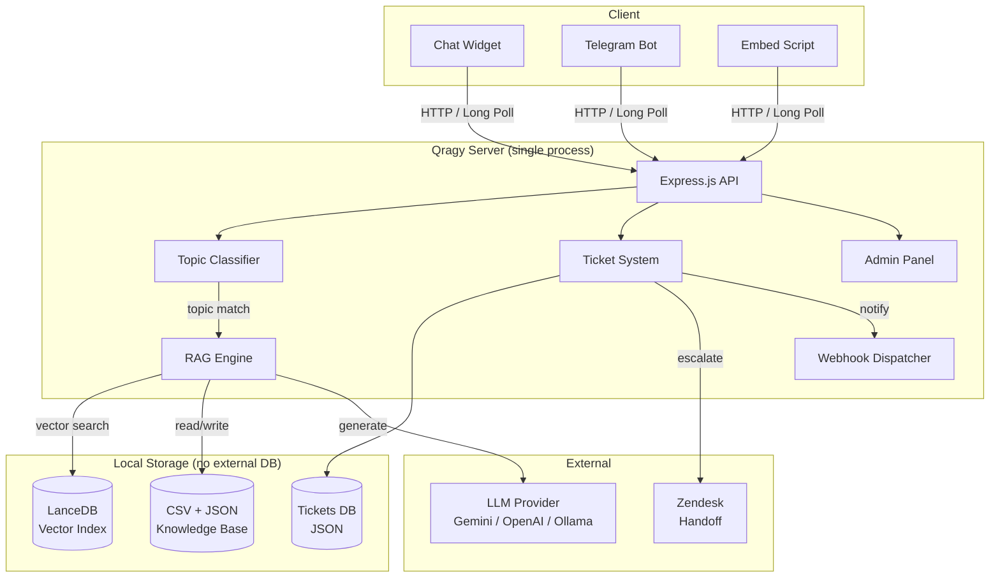

<p align="center">
  
</p>

<h1 align="center">Qragy</h1>

<p align="center">
  <strong>Self-hosted RAG chatbot that runs on a Raspberry Pi. $0/month.</strong>
</p>

<p align="center">
  <a href="https://github.com/mahsumaktas/qragy/stargazers"></a>
  <a href="https://github.com/mahsumaktas/qragy/releases"></a>
  <a href="LICENSE"></a>
  
  
  <a href="CONTRIBUTING.md"></a>
</p>

<p align="center">
  <a href="#quick-start">Quick Start</a> ·
  <a href="#features">Features</a> ·
  <a href="#architecture">Architecture</a> ·
  <a href="#admin-panel">Admin Panel</a> ·
  <a href="#deploy">Deploy</a> ·
  <a href="#api">API</a> ·
  <a href="#configuration">Configuration</a>
</p>

<p align="center">
  <a href="https://render.com/deploy?repo=https://github.com/mahsumaktas/qragy"></a>
</p>

---

## Why Qragy?

**Dify needs Docker, Redis, and Postgres.** Botpress is cloud-only. Intercom costs $74/seat/month.

**Qragy needs one command: `npm start`.** Multi-model support (Gemini, OpenAI, Ollama) with zero extra dependencies.

It uses [LanceDB](https://lancedb.com) (embedded vector DB) and supports multiple AI providers, so you get a production-ready AI support chatbot with zero infrastructure cost — even on a **$35 Raspberry Pi**.

> One process. One CSV file. 7 npm dependencies. Zero cloud bills.

| Feature | Qragy | Dify | LibreChat | Open WebUI |
|---------|-------|------|-----------|------------|
| Runs on Pi | Yes | No | No | No |
| Min RAM | 150MB | 4GB+ | 2GB+ | 1GB+ |
| Dependencies | 7 npm | Docker+ | 5 services | Docker+ |
| Setup time | 30sec | 30min+ | 20min+ | 15min+ |
| Multi-model | Yes | Yes | Yes | Yes |
| RAG built-in | Yes | Yes | No | Yes |
| Admin panel | Yes | Yes | No | Yes |

---

## Features

### 🧠 RAG-Powered AI
- **Vector search** over your knowledge base using LanceDB (embedded, serverless)
- **Multi-model** — Gemini, OpenAI, Ollama (local LLM) out of the box
- **Topic routing** — keywords + AI classify issues into structured flows
- **Deterministic collection** — bot gathers required info before escalating
- **Model fallback** — automatic retry with a secondary model
- **Smart chunking** — markdown, recursive, and sentence-based document splitting

### 🎛️ Admin Panel (`/admin`)
Manage everything from the browser — no code, no CLI:

| Tab | What You Can Do |
|-----|----------------|
| **Tickets** | Full chat histories, handoff status, assignment, priority, internal notes |
| **Knowledge Base** | CRUD for Q&A entries, file upload (PDF/DOCX/TXT), one-click re-embed |
| **Bot Config** | Edit persona, topics, escalation rules, memory templates, env vars |
| **Analytics** | Daily metrics, top topics, resolution rates, SVG charts |
| **System** | Health monitoring, uptime, memory usage, hot-reload |

### 📦 Zero Infrastructure
- **LanceDB** — embedded vector DB, no separate server (unlike Pinecone/Weaviate/Qdrant)
- **File-based storage** — CSV + JSON + LanceDB files. No PostgreSQL, no Redis
- **Single process** — one `node server.js`, that's it
- **No build step** — vanilla JS frontend, zero bundling

### 🔌 Integrations
- **Zendesk** — automatic widget + Sunshine Conversations handoff
- **Telegram** — bot channel via long polling
- **Webhooks** — HMAC-SHA256 signed events to Slack, n8n, Zapier
- **Embeddable widget** — one `<script>` tag on any website

### 🆓 Free Embedding Models

| Provider | Model | Dimensions | Cost |
|----------|-------|-----------|------|
| **Google Gemini** *(default)* | `gemini-embedding-001` | 3072 | Free tier |
| **OpenAI** | `text-embedding-3-small` | 1536 | $0.02/1M tokens |
| **Ollama** | `nomic-embed-text` | 768 | Free (local) |

### 🚀 v2 Highlights
- **Multi-model support** — Gemini + OpenAI + Ollama via raw fetch() (zero new deps)
- **Document chunking engine** — markdown, recursive, sentence strategies
- **Docker support** — `docker run` and you're live
- Rate limiting (per-IP, configurable)
- File upload with auto-chunking (PDF, DOCX, TXT)
- Team features: ticket assignment, priority levels, internal notes
- Prompt versioning with auto-snapshot and rollback
- Auto-deploy webhook support

---

## Architecture



**Message flow:**

1. User sends a message → **Topic detection** (keywords + AI classification)
2. **RAG search** finds relevant Q&A from the knowledge base
3. **LLM** generates a contextual reply using topic instructions + RAG results
4. Bot collects required fields → **Escalation** to Zendesk when needed

---

## Quick Start

### Docker (Fastest)

```bash
docker run -d -p 3001:3000 \
  -e GOOGLE_API_KEY=your_key \
  -v qragy-data:/app/data \
  ghcr.io/mahsumaktas/qragy
```

Open `http://localhost:3001` — done.

### From Source

```bash
# Clone & install
git clone https://github.com/mahsumaktas/qragy.git
cd qragy && npm install

# Configure (only GOOGLE_API_KEY is required)
cp .env.example .env
# Get a free key at https://aistudio.google.com

# Ingest your knowledge base
node scripts/ingest.js

# Run
npm start
```

Open [localhost:3000](http://localhost:3000) for the chatbot, [localhost:3000/admin](http://localhost:3000/admin) for the admin panel.

---

## Multi-Model Configuration

Qragy supports **Gemini**, **OpenAI**, and **Ollama** (local LLM) out of the box. No extra dependencies needed.

### Gemini (Default, Free Tier)

```env
GOOGLE_API_KEY=your_key_here
```

### OpenAI

```env
LLM_PROVIDER=openai
LLM_API_KEY=sk-...
LLM_MODEL=gpt-4o-mini
EMBEDDING_PROVIDER=openai
EMBEDDING_MODEL=text-embedding-3-small
```

### Ollama (Fully Local, No API Key)

```env
LLM_PROVIDER=ollama
LLM_MODEL=llama3.2
LLM_BASE_URL=http://localhost:11434/v1
EMBEDDING_PROVIDER=ollama
EMBEDDING_MODEL=nomic-embed-text
EMBEDDING_BASE_URL=http://localhost:11434
```

All `GOOGLE_*` environment variables continue to work for backward compatibility. See [`.env.example`](.env.example) for all options.

---

## Deploy

### Render (One-Click)

[](https://render.com/deploy?repo=https://github.com/mahsumaktas/qragy)

### Docker Compose

```bash
git clone https://github.com/mahsumaktas/qragy.git
cd qragy
cp .env.example .env   # add your API key
docker compose up -d
```

### Raspberry Pi

```bash
git clone https://github.com/mahsumaktas/qragy.git
cd qragy && npm install
cp .env.example .env    # add your GOOGLE_API_KEY
node scripts/ingest.js
npm install -g pm2
pm2 start server.js --name qragy
pm2 save && pm2 startup
```

### Any VPS / Docker

Works on any machine with Node.js 18+. No Docker required, but runs fine in a container too.

---

## Configuration

| Variable | Description | Default |
|----------|-------------|---------|
| `GOOGLE_API_KEY` | Gemini API key **(required for Gemini)** | — |
| `LLM_PROVIDER` | LLM provider (`gemini`, `openai`, `ollama`) | `gemini` |
| `LLM_API_KEY` | API key (falls back to GOOGLE_API_KEY) | — |
| `LLM_MODEL` | Chat model (falls back to GOOGLE_MODEL) | — |
| `LLM_BASE_URL` | Custom base URL (Ollama, etc.) | — |
| `EMBEDDING_PROVIDER` | Embedding provider | `gemini` |
| `EMBEDDING_MODEL` | Embedding model | `gemini-embedding-001` |
| `GOOGLE_MODEL` | Chat model | `gemini-3-pro-preview` |
| `GOOGLE_FALLBACK_MODEL` | Fallback model on error | — |
| `BOT_NAME` | Bot display name | `QRAGY Bot` |
| `COMPANY_NAME` | Your company name | — |
| `ADMIN_TOKEN` | Admin panel password | — |
| `ZENDESK_ENABLED` | Enable Zendesk handoff | `false` |
| `TELEGRAM_ENABLED` | Enable Telegram bot | `false` |
| `TELEGRAM_BOT_TOKEN` | Telegram Bot API token | — |
| `RATE_LIMIT_ENABLED` | Per-IP rate limiting | `true` |
| `RATE_LIMIT_MAX` | Max requests per window | `20` |
| `WEBHOOK_ENABLED` | Enable webhook notifications | `false` |
| `WEBHOOK_URL` | Webhook endpoint URL | — |
| `WEBHOOK_SECRET` | HMAC-SHA256 signing secret | — |
| `SUPPORT_HOURS_ENABLED` | Enforce business hours | `false` |
| `DETERMINISTIC_COLLECTION_MODE` | Structured info gathering | `true` |

Full list in [`.env.example`](.env.example).

---

## Embedding Widget

Add Qragy to any website:

```html
<script>
  window.__QRAGY_API = "https://your-qragy-server.com";
</script>
<script src="https://your-qragy-server.com/embed.js"></script>
```

---

## Project Structure

```
qragy/
├── server.js                       # App setup, middleware, route mounting, startup (~660 lines)
├── src/
│   ├── config/
│   │   └── index.js                # Centralized env config loader + validation
│   ├── routes/
│   │   ├── admin/                  # Admin panel API endpoints
│   │   │   ├── index.js            # Admin route aggregator
│   │   │   ├── agent.js            # Agent config CRUD
│   │   │   ├── analytics.js        # Analytics dashboard
│   │   │   ├── config.js           # Runtime config management
│   │   │   ├── insights.js         # SLA, auto-FAQ, content gaps
│   │   │   ├── knowledge.js        # Knowledge base management
│   │   │   ├── system.js           # System health, audit log
│   │   │   ├── tickets.js          # Ticket CRUD + bulk ops + prompt versions
│   │   │   └── webhooks.js         # Webhook config + test
│   │   ├── chat.js                 # POST /api/chat — main chat endpoint
│   │   ├── conversation.js         # Handoff, CSAT, file upload, session status
│   │   ├── deploy.js               # GitHub webhook auto-deploy
│   │   ├── health.js               # GET /api/health
│   │   └── widget.js               # GET /api/config (widget configuration)
│   ├── services/
│   │   ├── agentConfig.js          # Agent prompt/config file loader with caching
│   │   ├── analytics.js            # Event buffer, daily aggregation, CSAT tracking
│   │   ├── chatEngine.js           # Core chat logic (LLM calls, field collection)
│   │   ├── chatProcessor.js        # Chat message processing pipeline
│   │   ├── configStore.js          # Runtime config file store (chat flow, site, etc.)
│   │   ├── conversationManager.js  # Conversation CRUD + clarification tracking
│   │   ├── conversationUtils.js    # Conversation context building
│   │   ├── escalation.js           # Escalation rule evaluation
│   │   ├── knowledge.js            # Knowledge base search + content gaps
│   │   ├── llmHealth.js            # LLM error tracking + circuit breaker
│   │   ├── memory.js               # Conversation memory extraction
│   │   ├── promptBuilder.js        # Prompt builder service wrapper
│   │   ├── rag.js                  # RAG retrieval via LanceDB
│   │   ├── responseValidator.js    # Bot response safety validation
│   │   ├── statemachine.js         # Conversation state machine
│   │   ├── supportHours.js         # Business hours calculation
│   │   ├── ticketStore.js          # Ticket CRUD + duplicate detection
│   │   ├── topic.js                # Topic classification
│   │   ├── webChatPipeline.js      # Web chat orchestration pipeline
│   │   └── webhooks.js             # HMAC-signed webhook delivery with retry
│   ├── prompt/
│   │   └── builder.js              # System prompt assembly with token budgeting
│   ├── middleware/
│   │   ├── auth.js                 # Admin token authentication
│   │   ├── rateLimiter.js          # Per-IP rate limiting
│   │   ├── security.js             # CORS, Helmet, security headers
│   │   └── injectionGuard.js       # Prompt injection detection + output validation
│   └── utils/
│       ├── adminHelpers.js         # CSV data + .env file management
│       ├── conversationHelpers.js  # Message parsing utilities
│       ├── errorHelper.js          # Safe error serialization
│       ├── logger.js               # Structured logger [ISO] [LEVEL] [context]
│       ├── sanitizer.js            # PII masking, text normalization
│       ├── session.js              # Session ID generation
│       ├── ticketHelpers.js        # Ticket record building + duplicate detection
│       └── validators.js           # Input validators (email, phone, branch code)
├── lib/
│   ├── providers.js                # Multi-model LLM + embedding abstraction
│   ├── chunker.js                  # Document chunking engine
│   └── db.js                       # SQLite database layer
├── tests/
│   ├── unit/                       # 190+ unit tests (23 test files)
│   └── integration/                # Integration tests (supertest)
├── agent/                          # Bot personality & rules
│   ├── soul.md, persona.md         # Identity & tone
│   ├── topics/                     # Structured support flows
│   └── ...                         # Escalation, filtering, etc.
├── memory/                         # Conversation & ticket templates
├── public/                         # Frontend (vanilla JS, no build step)
├── scripts/ingest.js               # CSV → LanceDB embedder
├── Dockerfile                      # Docker image
├── docker-compose.yml              # Container setup
├── .github/workflows/ci.yml        # CI: lint + test + coverage
└── data/                           # Runtime data (auto-created)
```

### Design Patterns

- **Factory + DI**: Services use `createXxxService(deps)` — all dependencies injected
- **Route mounting**: Routes use `mount(app, deps)` pattern
- **CommonJS**: All modules use `require()` / `module.exports`
- **Getter closures**: Mutable runtime config accessed via `() => VALUE` getters

## Development

### Prerequisites

- Node.js 20+
- npm

### Setup

```bash
git clone https://github.com/mahsumaktas/qragy.git
cd qragy && npm install
cp .env.example .env  # add your API key
```

### Running Tests

```bash
npm test                  # Run all tests (190+ tests)
npm run test:coverage     # Run with coverage report
```

### Linting

```bash
npx eslint .              # Check for lint errors
npx eslint . --fix        # Auto-fix fixable issues
```

### Code Quality

- **ESLint** with flat config (eslint.config.js) — enforces `eqeqeq`, `no-var`, `prefer-const`
- **Vitest** for unit + integration testing with V8 coverage
- **CI Pipeline** runs lint + test on every push/PR to main

---

## Qragy vs Alternatives

| | **Qragy** | Dify | Botpress | Intercom |
|---|:---:|:---:|:---:|:---:|
| Fully self-hosted | ✅ | ⚠️ Partial | ❌ | ❌ |
| Runs on Raspberry Pi | ✅ | ❌ | ❌ | ❌ |
| Multi-model | ✅ | ✅ | ✅ | ❌ |
| Vector DB | Embedded | External | External | Managed |
| Min RAM | **150MB** | 4GB+ | 2GB+ | N/A |
| Monthly cost | **$0** | Free tier limited | Free tier limited | $74+/seat |
| Admin panel | Built-in | ✅ | ✅ | ✅ |
| Setup time | **30 sec** | 30+ min | 15+ min | N/A |
| Open source | MIT | Apache 2.0 | AGPL | ❌ |
| Dependencies | 7 npm packages | Docker + Redis + Postgres | Cloud | Cloud |

---

## API

All admin endpoints require `x-admin-token` header when `ADMIN_TOKEN` is set.

<details>
<summary><strong>View all endpoints</strong></summary>

### Chat
- `POST /api/chat` — Send message, get AI response

### Tickets
- `GET /api/admin/summary` — Dashboard stats
- `GET /api/admin/tickets` — List tickets
- `GET /api/admin/tickets/:id` — Ticket detail
- `PUT /api/admin/tickets/:id/assign` — Assign to team member
- `PUT /api/admin/tickets/:id/priority` — Set priority
- `POST /api/admin/tickets/:id/notes` — Add internal note

### Knowledge Base
- `GET /api/admin/knowledge` — List entries
- `POST /api/admin/knowledge` — Add entry
- `PUT /api/admin/knowledge/:id` — Update entry
- `DELETE /api/admin/knowledge/:id` — Delete entry
- `POST /api/admin/knowledge/reingest` — Rebuild vector index
- `POST /api/admin/knowledge/upload` — Upload PDF/DOCX/TXT

### Bot Config
- `GET/PUT /api/admin/agent/files/:name` — Read/write agent files
- `GET/POST/PUT/DELETE /api/admin/agent/topics/:id` — Topic CRUD
- `GET/PUT /api/admin/agent/memory/:name` — Memory templates
- `GET/PUT /api/admin/env` — Environment variables

### Analytics & System
- `GET /api/admin/analytics` — Metrics and charts
- `GET /api/admin/system` — Health info
- `POST /api/admin/agent/reload` — Hot-reload config

### Webhooks
- `GET /api/admin/webhooks/config` — Get config
- `PUT /api/admin/webhooks/config` — Update config
- `POST /api/admin/webhooks/test` — Send test webhook

### Prompt Versions
- `GET /api/admin/agent/versions` — List versions
- `POST /api/admin/agent/versions/rollback` — Rollback

</details>

---

## Tech Stack

| Layer | Technology |
|-------|-----------|
| Runtime | Node.js 18+ |
| Framework | Express.js |
| AI | Gemini, OpenAI, Ollama (multi-provider) |
| Vector DB | LanceDB (embedded, serverless) |
| Embeddings | Gemini / OpenAI / Ollama (configurable) |
| Frontend | Vanilla JS — zero build step |
| Database | SQLite (better-sqlite3) + LanceDB |
| Storage | JSON config files, CSV knowledge base |
| Container | Docker (optional) |

---

## Contributing

We welcome contributions! See [CONTRIBUTING.md](CONTRIBUTING.md) for guidelines.

## License

[MIT](LICENSE) — use it however you want.

---

<p align="center">
  <sub>Built with ❤️ by <a href="https://github.com/mahsumaktas">Mahsum Aktas</a></sub>
</p>
